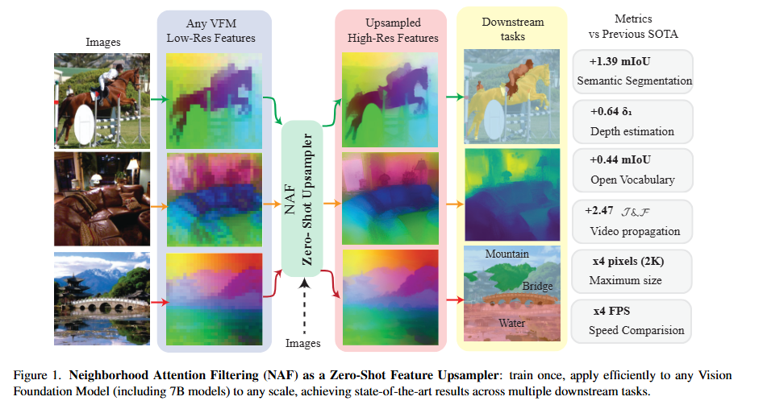
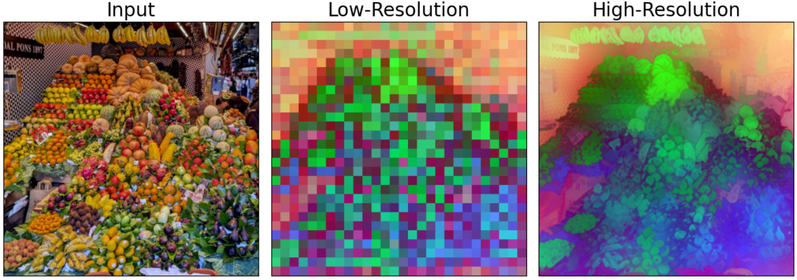

# Official Implementation of *NAF: Zero-Shot Feature Upsampling via Neighborhood Attention Filtering.*

> [**NAF: Zero-Shot Feature Upsampling via Neighborhood Attention Filtering.**]<br>
> [Loick Chambon](https://loickch.github.io/),  [Paul Couairon](https://pcouairon.github.io/), [Eloi Zablocki](https://scholar.google.fr/citations?user=dOkbUmEAAAAJ&hl=fr), [Alexandre Boulch](https://boulch.eu/), [Nicolas Thome](https://thome.isir.upmc.fr/), [Matthieu Cord](https://cord.isir.upmc.fr/).<br> Valeo.ai, Sorbonne University, CNRS.<br> 

<table>
  <p align="center">
    
    <a href="https://github.com/valeoai/NAF/releases/download/model/vfm_comparison.mp4">
      <br><br>
      <strong>▶️ Full quality (here)</strong>
    </a>
  </p>
</table>

<div align="center">

<table>
  <thead>
    <tr>
      <th align="left">Method</th>
      <th align="center">Semantic Seg.</th>
      <th align="center">Depth Est.</th>
      <th align="center">Open Vocab.</th>
      <th align="center">Video Prop.</th>
      <th align="center">⚡ FPS</th>
      <th align="center">📏 Max Ratio</th>
    </tr>
  </thead>
  <tbody>
    <tr>
      <td><strong>FeatUp</strong></td>
      <td align="center">4th</td>
      <td align="center">4th</td>
      <td align="center">3rd</td>
      <td align="center">4th</td>
      <td align="center">🥈</td>
      <td align="center">🥈</td>
    </tr>
    <tr>
      <td><strong>JAFAR</strong></td>
      <td align="center">🥈</td>
      <td align="center">3rd</td>
      <td align="center">🥈</td>
      <td align="center">🥇</td>
      <td align="center">3rd</td>
      <td align="center">4th</td>
    </tr>
    <tr>
      <td><strong>AnyUp</strong></td>
      <td align="center">3rd</td>
      <td align="center">🥈</td>
      <td align="center">4th</td>
      <td align="center">3rd</td>
      <td align="center">3rd</td>
      <td align="center">3rd</td>
    </tr>
    <tr>
      <td><strong>NAF (ours)</strong></td>
      <td align="center">🥇</td>
      <td align="center">🥇</td>
      <td align="center">🥇</td>
      <td align="center">🥈</td>
      <td align="center">🥇</td>
      <td align="center">🥇</td>
    </tr>
  </tbody>
</table>

*🏆 **Performance Summary:** Ranks (🥇 First · 🥈 Second)*

</div>

## 🎯 TL;DR

**Three simple steps:**
1. **Select any Vision Foundation Model** ([DINOv3](https://github.com/facebookresearch/dinov3), [DINOv2](https://github.com/facebookresearch/dinov2), [RADIO](https://github.com/NVlabs/RADIO), [FRANCA](https://github.com/valeoai/Franca), [PE-CORE](https://github.com/facebookresearch/perception_models), [CLIP](https://github.com/openai/CLIP), [SAM](https://github.com/facebookresearch/segment-anything), etc.)
2. **Choose your target resolution** (up to 2K)
3. **Upsample features with NAF** — zero-shot, no retraining needed

**Why it works:** NAF combines classical filtering theory with modern attention mechanisms, learning adaptive kernels through Fourier space transformations.

**Usage:** To use NAF on any features, to any resolution, simply run the following code (note that natten should be installed, see [INSTALL.md](docs/INSTALL.md)):

```python
import torch

device = "cuda" if torch.cuda.is_available() else "cpu"
NAF = torch.hub.load("valeoai/NAF", "naf", pretrained=True, device=device)
NAF.eval()

# High-resolution image (B, 3, H, W)
image = ...
# Low-resolution features (B, C, h, w)
lr_features = ...   
# Desired output size (H_o, W_o)
target_size = ...                                

# High-resolution features (B, C, H_o, W_o)
upsampled = NAF(image, lr_features, target_size)
```


## ⚡ News & Updates
- [ ] Release trained checkpoints for **NAF++**.
- [x] **[2025-11-25]** NAF has been uploaded on arXiv.
- [x] **[2025-11-24]** NAF code has been publicly released.


## 📜 Abstract

### Summary
Vision Foundation Models produce **downsampled spatial features**, which are challenging for pixel-level tasks.  

❌ Traditional upsampling methods:  
* **Classical filters** – fast, generic, but fixed  (bilinear, bicubic, joint bilateral, guided)
* **Learnable VFM-specific upsamplers** – accurate, but need retraining ([FeatUp](https://github.com/mhamilton723/FeatUp), [LiFT](https://github.com/saksham-s/lift), [JAFAR](https://github.com/PaulCouairon/JAFAR), [LoftUp](https://github.com/andrehuang/loftup))

✅ **NAF (Neighborhood Attention Filtering)**:  
* Learns **adaptive spatial-and-content weights** using Cross-Scale Neighborhood Attention + RoPE  
* Works **zero-shot** for any VFM  
* Outperforms existing upsamplers on **multiple downstream tasks**  
* Efficient: scales up to 2K features, ~18 FPS for intermediate resolutions  
* Also effective for **image restoration**  

### Overview
<table>
  <tr>
    <td align="center" width="50%">
      
    </td>
  </tr>
  
</table>

### Full abstract

*Vision Foundation Models (VFMs) extract spatially downsampled representations, posing challenges for pixel-level tasks.
Existing upsampling approaches face a fundamental trade-off: classical filters are fast and broadly applicable but rely on fixed forms, while modern upsamplers achieve superior accuracy through learnable, VFM-specific forms at the cost of retraining for each VFM.*
*We introduce Neighborhood Attention Filtering (NAF), which bridges this gap by learning adaptive spatial-and-content weights through Cross-Scale Neighborhood Attention and Rotary Position Embeddings (RoPE), guided solely by the high-resolution input image.*
*NAF operates zero-shot: it upsamples features from any VFM without retraining, making it the first VFM-agnostic architecture to outperform VFM-specific upsamplers and achieve state-of-the-art performance across multiple downstream tasks.*
*It maintains high efficiency, scaling to 2K feature maps and reconstructing intermediate-resolution maps at 18 FPS.
Beyond feature upsampling, NAF demonstrates strong performance on image restoration, highlighting its versatility.*


## 🔄 Notebooks 

We provide Jupyter notebooks to easily run NAF for inference and visualize attention maps:
- Inference: [notebooks/inference.ipynb](notebooks/inference.ipynb) runs NAF upsampler on any VFM.

<table align="center">
  <tr>
    <td align="center">
      
      <br>
      <em>NAF enables zero-shot feature upsampling across any Vision Foundation Model</em>
    </td>
  </tr>
</table>
<table align="center">
  <tr>
    <td align="center">
      
      <br>
      <em>Seamless upsampling from low-resolution to high-resolution features</em>
    </td>
  </tr>
</table>

- Attention Maps: [notebooks/attention_maps.ipynb](notebooks/attention_maps.ipynb) visualizes NAF neighborhood attention maps.

<table>
  <tr>
    <td align="center" width="50%">
      
    </td>
  </tr>
  
  <tr>
    <td colspan="2" align="center">
      <em>Given a query point and a kernel size, we compute and show its neighborhood attention map.</em>
    </td>
  </tr>
</table>


## 🔨 Setup

See the docs folder for detailed setup instructions concerning [installs](docs/INSTALL.md), [datasets](docs/DATASETS.md), [training](docs/TRAINING.md) and [evaluation](docs/EVALUATIONS.md).

If you need or want to retrain NAF, it takes less than 2 hours and consumes less than 8GB of GPU memory on a single NVIDIA A100. Otherwise, we provide pretrained weights for direct evaluation. We can also share evaluation logs upon request.

## 👍 Acknowledgements

Many thanks to these excellent open source projects:
* https://github.com/SHI-Labs/NATTEN
* https://github.com/PaulCouairon/JAFAR
* https://github.com/mhamilton723/FeatUp
* https://github.com/saksham-s/lift/tree/main
* https://github.com/mc-lan/ProxyCLIP

To structure our code we used:
* [Lightning-Hydra Template](https://github.com/ashleve/lightning-hydra-template)
* [Hydra](https://github.com/facebookresearch/hydra)
* [Pytorch-Lightning](https://github.com/Lightning-AI/pytorch-lightning)

Do not hesitate to look and support our previous feature upsampling work:
* https://github.com/PaulCouairon/JAFAR


## ✏️ Bibtex

If this work is helpful for your research, please consider citing the following BibTeX entry and putting a star on this repository. Feel free to open an issue for any questions.

```
@misc{chambon2025naf,
      title={NAF: Zero-Shot Feature Upsampling via Neighborhood Attention Filtering.}, 
      author={Loick Chambon and Paul Couairon and Eloi Zablocki and Alexandre Boulch and Nicolas Thome and Matthieu Cord},
      year={2025},
}
```
